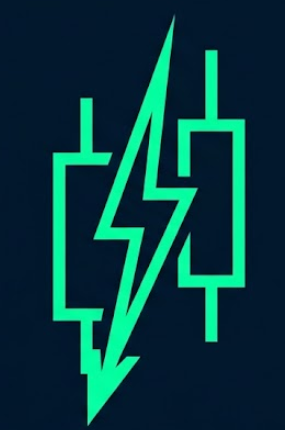
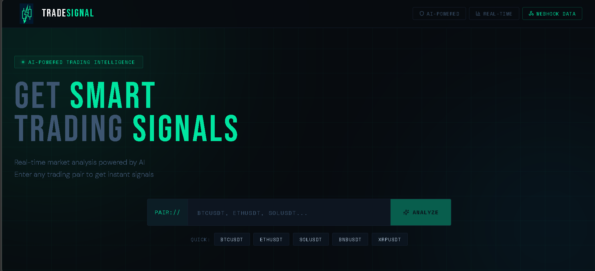
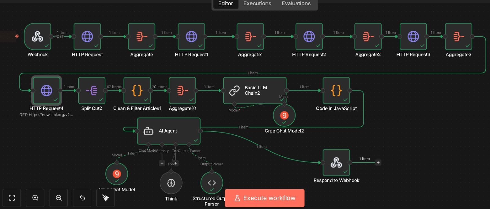
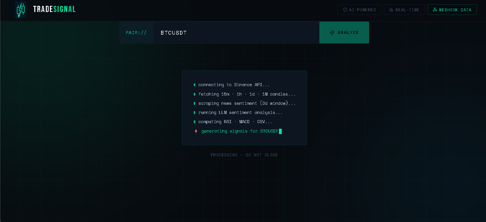
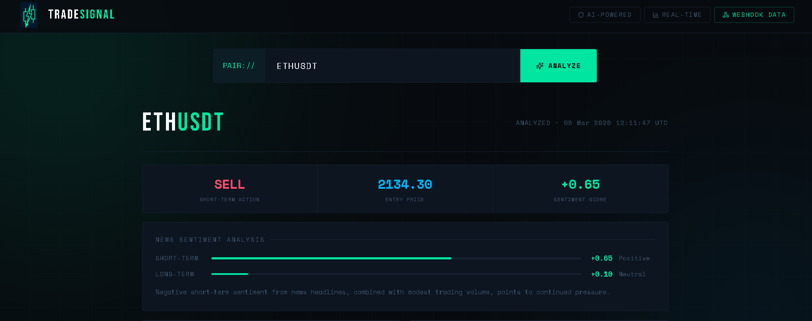
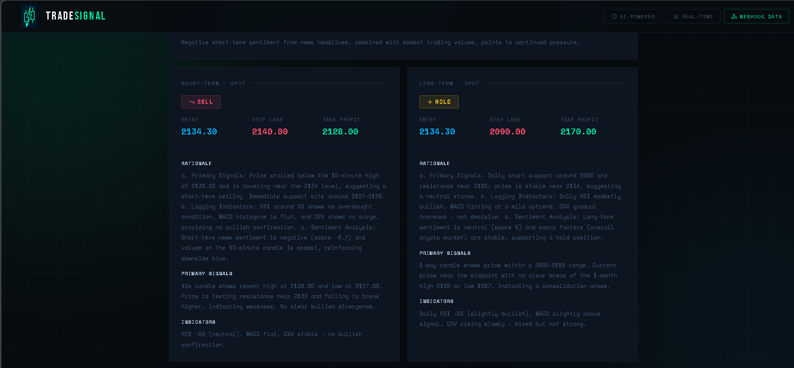

<div align="center">

# 🚀 Crypto AI Signals

### AI-Powered Cryptocurrency Trading Signals Platform

[](https://reactjs.org/)
[](https://www.typescriptlang.org/)
[](https://tailwindcss.com/)
[](https://n8n.io/)

[](https://bitcoin.org/)
[](https://ethereum.org/)
[](https://www.binance.com/)



**Real-time cryptocurrency trading signals powered by AI, multi-timeframe technical analysis, and sentiment data.**

[🎥 Watch Demo](#-demo-video) • [✨ Features](#-features) • [🚀 Quick Start](#-quick-start) • [📖 Documentation](#-documentation)

---

### 🎥 Demo

<div align="center">
  
</div>

---

</div>

## 🌟 Overview

Crypto AI Signals is a cutting-edge trading signals platform that combines **artificial intelligence**, **multi-timeframe technical analysis**, and **real-time sentiment data** to provide institutional-grade trading signals for cryptocurrency markets.

### 🎯 What Makes This Special?

- 🤖 **AI-Powered Analysis** using Groq's GPT-OSS 120B model
- 📊 **Multi-Timeframe Analysis** (15m, 1h, 1d, 1M candles)
- 📰 **Real-Time Sentiment** from global news sources
- ⚡ **Lightning Fast** responses via N8N automation
- 🎨 **Beautiful UI** with smooth animations
- 🔄 **Automated Workflow** for seamless data processing

---

## ✨ Features

### 🔥 Core Features

| Feature | Description |
|---------|-------------|
| **AI Trading Signals** | Get BUY/SELL/HOLD recommendations with confidence scores |
| **Short-Term Analysis** | Quick scalping opportunities with tight stop-losses |
| **Long-Term Analysis** | Position trading signals for bigger moves |
| **Market Overview** | Comprehensive technical indicators (RSI, MACD, OBV) |
| **Sentiment Analysis** | News-driven market sentiment scoring |
| **Risk Management** | Precise entry, target, and stop-loss levels |
| **Webhook Integration** | Real-time data flow via N8N webhooks |
| **Responsive Design** | Works perfectly on desktop and mobile |

### 🛠️ Technical Features

- ⚡ **Vite** for blazing-fast development
- 🎨 **Tailwind CSS** + **shadcn/ui** for beautiful components
- 🎭 **Framer Motion** for smooth animations
- � *U*TanStack Query** for efficient data fetching
- 🔐 **Type-safe** with TypeScript
- 🎯 **Real-time updates** with webhook integration

---

## 🏗️ Architecture

```
┌─────────────────┐
│   React App     │
│  (Frontend UI)  │
└────────┬────────┘
         │
         ↓ POST /webhook
┌─────────────────┐
│  N8N Workflow   │
│   (Automation)  │
└────────┬────────┘
         │
    ┌────┴────┬────────┬──────────┐
    ↓         ↓        ↓          ↓
┌────────┐ ┌──────┐ ┌──────┐ ┌────────┐
│Binance │ │ Groq │ │ News │ │  Data  │
│  API   │ │ LLM  │ │ API  │ │Process │
└────────┘ └──────┘ └──────┘ └────────┘
```

---

## 🚀 Quick Start

### Prerequisites

- Node.js 18+ and npm
- N8N instance (local or cloud)
- API Keys:
  - Binance API (free)
  - Groq API (free tier available)
  - NewsAPI (free tier available)

### Installation

```bash
# 1. Clone the repository
git clone https://github.com/MuzammilBaloch-22/Crypto-Ai-Signals.git

# 2. Navigate to project directory
cd Crypto-Ai-Signals

# 3. Install dependencies
npm install

# 4. Start development server
npm run dev
```

The app will be available at `http://localhost:8080`

### N8N Workflow Setup

**📥 Download N8N Workflow:**
- 📄 **[Click here to download trading-signal-workflow.json](./n8n-workflows/trading-signal-workflow.json)**
- 📖 **[View N8N Setup Guide](./n8n-workflows/README.md)**

**Import Steps:**

1. **Download the JSON file** from the link above

2. **Open N8N** and click "Import from File"

3. **Select** the downloaded `trading-signal-workflow.json`

4. **Configure Credentials**
   - Add Binance API credentials
   - Add Groq API key
   - Add NewsAPI key

5. **Update Webhook URL** in `src/pages/Index.tsx`:
   ```typescript
   const WEBHOOK_URL = "http://localhost:5678/webhook-test/YOUR-WEBHOOK-ID";
   ```

6. **Activate Workflow** in N8N

---

## 📖 Documentation

### How It Works

1. **User Input** → Enter trading pair (e.g., BTCUSDT)
2. **Webhook Trigger** → POST request to N8N workflow
3. **Data Collection** → Fetch from Binance, NewsAPI
4. **AI Analysis** → Groq LLM processes multi-timeframe data
5. **Signal Generation** → Returns structured trading signals
6. **Display Results** → Beautiful UI shows analysis

### API Endpoints

#### Webhook Endpoint
```
POST http://localhost:5678/webhook-test/YOUR-WEBHOOK-ID
Content-Type: application/json

{
  "pair": "BTCUSDT"
}
```

#### Response Format
```json
{
  "short_term": {
    "action": "BUY",
    "entry_price": "67240.00",
    "take_profit": "72500.00",
    "stop_loss": "64800.00",
    "rationale": "Strong support with increasing volume..."
  },
  "long_term": {
    "action": "HOLD",
    "entry_price": "67240.00",
    "take_profit": "74000.00",
    "stop_loss": "63500.00",
    "rationale": "Consolidation phase..."
  }
}
```

---

## 🎨 Screenshots

<div align="center">

### 🏠 Hero Section
*Clean, modern interface with real-time crypto ticker*



---

### ⚙️ N8N Workflow
*Automated backend workflow for data processing and AI analysis*



---

### 🔄 Processing
*Real-time analysis in progress*



---

### 📊 Trading Signals
*AI-generated BUY/SELL signals with entry, target, and stop-loss levels*



---

### 📈 Market Analysis
*Comprehensive technical indicators and sentiment analysis*



</div>

---

## 🛠️ Tech Stack

### Frontend
- **React 18** - UI library
- **TypeScript** - Type safety
- **Vite** - Build tool
- **Tailwind CSS** - Styling
- **shadcn/ui** - Component library
- **Framer Motion** - Animations
- **TanStack Query** - Data fetching

### Backend & APIs
- **N8N** - Workflow automation
- **Binance API** - Real-time crypto data
- **Groq LLM** - AI analysis (GPT-OSS 120B)
- **NewsAPI** - Sentiment data

### DevOps
- **Git** - Version control
- **GitHub** - Repository hosting
- **Vite** - Development server

---

## 📁 Project Structure

```
Crypto-Ai-Signals/
├── src/
│   ├── components/       # Reusable UI components
│   │   └── ui/          # shadcn/ui components
│   ├── pages/           # Page components
│   │   ├── Index.tsx    # Main trading page
│   │   └── WebhookData.tsx  # Webhook monitor
│   ├── hooks/           # Custom React hooks
│   ├── lib/             # Utility functions
│   └── main.tsx         # App entry point
├── public/              # Static assets
│   └── logo.png         # App logo
├── n8n-workflows/       # N8N workflow files
│   ├── README.md        # Workflow documentation
│   └── trading-signal-workflow.json
├── video/               # Demo video
└── README.md            # This file
```

---

## 🔧 Configuration

### Environment Variables

Create a `.env` file in the root directory:

```env
VITE_N8N_WEBHOOK_URL=http://localhost:5678/webhook-test/YOUR-WEBHOOK-ID
VITE_BINANCE_API_URL=https://api.binance.com/api/v3
```

### N8N Credentials

Required credentials in N8N:
- **Binance API** - Get from [Binance API Management](https://www.binance.com/en/my/settings/api-management)
- **Groq API** - Get from [Groq Console](https://console.groq.com/)
- **NewsAPI** - Get from [NewsAPI.org](https://newsapi.org/)

---

## 🎯 Usage Guide

### Basic Usage

1. **Open the app** at `http://localhost:8080`
2. **Enter a trading pair** (e.g., BTCUSDT, ETHUSDT, SOLUSDT)
3. **Click "Analyze"** button
4. **View results:**
   - Overall action (BUY/SELL/HOLD)
   - Entry price and sentiment score
   - Short-term position with leverage
   - Long-term position with leverage
   - Market overview and indicators
   - Sentiment analysis
   - Detailed rationale

### Advanced Features

- **Quick Pairs** - Click preset pairs for instant analysis
- **Webhook Monitor** - View all webhook requests/responses
- **Real-time Updates** - Data refreshes automatically

---

## 🤝 Contributing

Contributions are welcome! Here's how you can help:

1. 🍴 Fork the repository
2. 🔨 Create a feature branch (`git checkout -b feature/AmazingFeature`)
3. 💾 Commit your changes (`git commit -m 'Add some AmazingFeature'`)
4. 📤 Push to the branch (`git push origin feature/AmazingFeature`)
5. 🎉 Open a Pull Request

### Development Guidelines

- Follow TypeScript best practices
- Use Tailwind CSS for styling
- Write clean, documented code
- Test thoroughly before submitting

---

## 📝 License

This project is licensed under the **MIT License** - see the [LICENSE](LICENSE) file for details.

---

## ⚠️ Disclaimer

**IMPORTANT:** This tool is for **educational and informational purposes only**.

- ❌ **NOT financial advice**
- ❌ **NOT investment recommendations**
- ❌ **NOT guaranteed to be profitable**

The signals generated are AI-based predictions and should not be the sole basis for trading decisions. Cryptocurrency trading carries significant risk. Always:

- ✅ Do your own research (DYOR)
- ✅ Consult with financial advisors
- ✅ Only invest what you can afford to lose
- ✅ Use proper risk management

**The developer is not responsible for any financial losses incurred from using this tool.**

---

## 👨‍💻 Developer

<div align="center">

### Muzammil Ahmed

**Agentic Ai Developer**

[](https://www.linkedin.com/in/muzammil-ahmed-0902612a5/)
[](https://www.instagram.com/muzammil_baloch.py/)
[](https://github.com/MuzammilBaloch-22)

*Building the future of automated trading with AI* 🚀

</div>

---

## 🌟 Show Your Support

If you found this project helpful, please consider:

- ⭐ **Starring** this repository
- 🍴 **Forking** for your own projects
- 📢 **Sharing** with the community
- 💬 **Following** for more projects

---

## 📞 Contact & Support

- 📧 Email: muzammilbaloch.dev@gmail.com
- 💬 Issues: [GitHub Issues](https://github.com/MuzammilBaloch-22/Crypto-Ai-Signals/issues)
- 🐛 Bug Reports: Use issue templates
- 💡 Feature Requests: Open a discussion

---

## 🙏 Acknowledgments

Special thanks to:

- **Binance** for providing free crypto market data API
- **Groq** for lightning-fast LLM inference
- **NewsAPI** for real-time news sentiment data
- **N8N** for powerful workflow automation
- **shadcn/ui** for beautiful UI components
- **The open-source community** for amazing tools

---

<div align="center">

### 🚀 Ready to Get Started?

```bash
git clone https://github.com/MuzammilBaloch-22/Crypto-Ai-Signals.git
cd Crypto-Ai-Signals
npm install
npm run dev
```

**Made with ❤️ by [Muzammil Ahmed](https://github.com/MuzammilBaloch-22)**

⭐ Star this repo if you find it useful!

</div>
